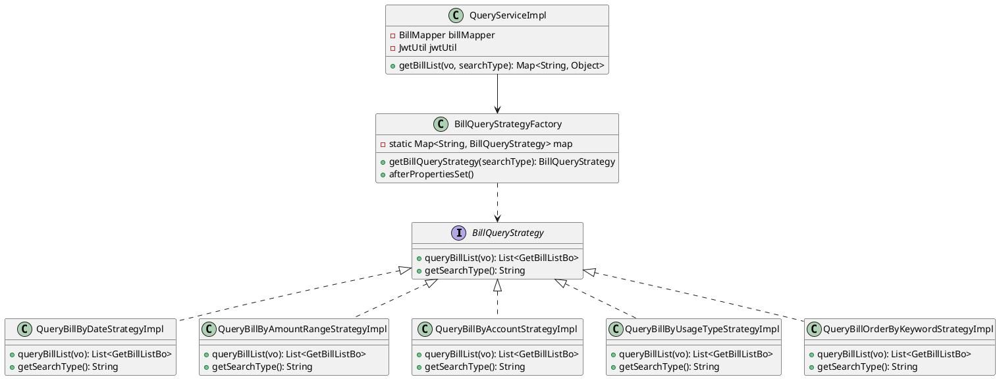
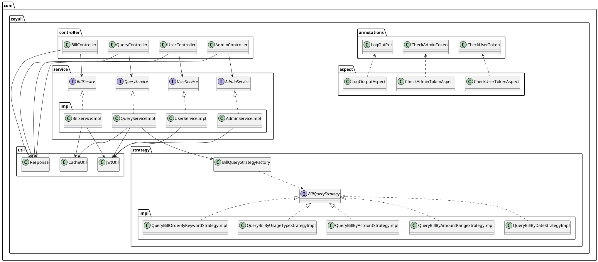

# 账单系统

## 项目架构

1. 服务器配置（8GB）运行springboot+vue==>福州
2. 服务器配置（2GB）运行redis==>上海
3. 服务器配置 运行Open Gauss

## 核心实现亮点

### 1. AOP横切编程

项目使用Spring AOP实现了多种横切关注点：

- **权限控制**：通过`@CheckUserToken`和`@CheckAdminToken`注解实现用户和管理员的token验证
- **日志输出**：通过`@LogOutPut`注解实现方法调用日志的自动输出
- **统一异常处理**：实现了全局异常处理器，统一处理各种异常情况

### 2. 多级缓存架构

项目采用了二级缓存架构，提高了系统的响应速度和吞吐量：

- **一级缓存（Caffeine）**：本地缓存，缓存热点数据（如最近7天的账单、第一页账单列表）
- **二级缓存（Redis）**：分布式缓存，缓存多页账单列表和账单详情
- **缓存策略**：
  - 热点数据自动预热
  - 缓存空值防止缓存穿透
  - 随机过期时间防止缓存雪崩
  - 异步写入缓存提高响应速度

### 3. 策略模式实现多维度查询

项目使用策略模式实现了多种账单查询方式：

- 按日期查询
- 按金额范围查询
- 按账户查询
- 按使用类型查询
- 按关键词排序查询

### 4. 异步处理机制

项目大量使用异步处理，提高了系统的吞吐量：

- 异步写入缓存
- 异步批量刷盘
- 异步预热热点数据
- 异步执行事务外的操作

## 账单查询流程

```puml
@startuml
start

:客户端请求获取账单列表;

:调用BillController.getBillList方法;

:验证用户Token(AOP);

:尝试从一级缓存(Caffeine)获取数据;
if (命中一级缓存?)
then (是)
    :返回缓存数据;
    stop
else (否)
    :尝试从二级缓存(Redis)获取数据;
    if (命中二级缓存?)
then (是)
        :返回缓存数据;
        stop
    else (否)
        :从数据库查询数据;
        if (查询结果为空?)
then (是)
            :缓存空值到Redis;
            :返回错误信息;
            stop
        else (否)
            :异步写入一级缓存(Caffeine);
            :异步写入二级缓存(Redis);
            :返回查询结果;
            stop
        endif
    endif
endif

stop
@enduml
```

## 策略模式实现



## 多级缓存架构

```puml
@startuml

actor Client as 客户端

package "应用层" {
    class BillController {
        + getBillList()
        + getBillDetail()
    }
    
    class QueryController {
        + getBillList()
    }
}

package "服务层" {
    class BillServiceImpl {
        + getBillList()
        + getBillDetail()
    }
    
    class QueryServiceImpl {
        + getBillList()
    }
}

package "缓存层" {
    frame "一级缓存(Caffeine)" {
        class LocalCache {
            - localBillCache: Cache<String, BillPo>
            - localBillListCache: Cache<String, List<GetBillListBo>>
        }
    }
    
    frame "二级缓存(Redis)" {
        class RedisCache {
            - RedisTemplate<String, Object> redisTemplate
        }
    }
    
    class CacheUtil {
        + getBillFromLocalCache()
        + getBillFromRedis()
        + getBillListFromLocalCache()
        + getBillListFromRedis()
        + asyncWriteLocalCache()
        + asyncWriteRedisCache()
    }
}

package "数据层" {
    class BillMapper {
        + getBillList()
        + getBillDetail()
    }
    
    database "Open Gauss" as DB
}

客户端 --> BillController
客户端 --> QueryController

BillController --> BillServiceImpl
QueryController --> QueryServiceImpl

BillServiceImpl --> CacheUtil
QueryServiceImpl --> CacheUtil

CacheUtil --> LocalCache
CacheUtil --> RedisCache

BillServiceImpl --> BillMapper
QueryServiceImpl --> BillMapper

BillMapper --> DB

@enduml
```

## 项目核心类关系



## 技术栈

| 技术 | 版本 | 用途 |
| --- | --- | --- |
| Spring Boot | 3.x | 后端框架 |
| MyBatis-Plus | 3.x | ORM框架 |
| Redis | 7.x | 二级缓存 |
| Caffeine | 3.x | 一级缓存 |
| JWT | - | 身份认证 |
| Open Gauss | - | 数据库 |
| Vue | 3.x | 前端框架 |

## 项目优势

1. **高性能**：多级缓存架构，热点数据优先加载，提高响应速度
2. **高扩展性**：策略模式支持多种查询方式，易于扩展新的查询策略
3. **高可用性**：异步处理机制，提高系统吞吐量和容错能力
4. **安全性**：AOP权限控制，JWT身份认证，确保系统安全
5. **可维护性**：清晰的代码结构，模块化设计，易于维护和扩展
6. **缓存优化**：缓存空值防止穿透，随机过期时间防止雪崩，热点数据预热提高命中率

## 总结

本项目实现了一个功能完整、性能优异的账单系统，采用了多种设计模式和优化策略，包括AOP横切编程、多级缓存架构、策略模式、异步处理等。系统具有高性能、高扩展性、高可用性和安全性等优势，能够满足不同场景下的账单管理需求。
 
