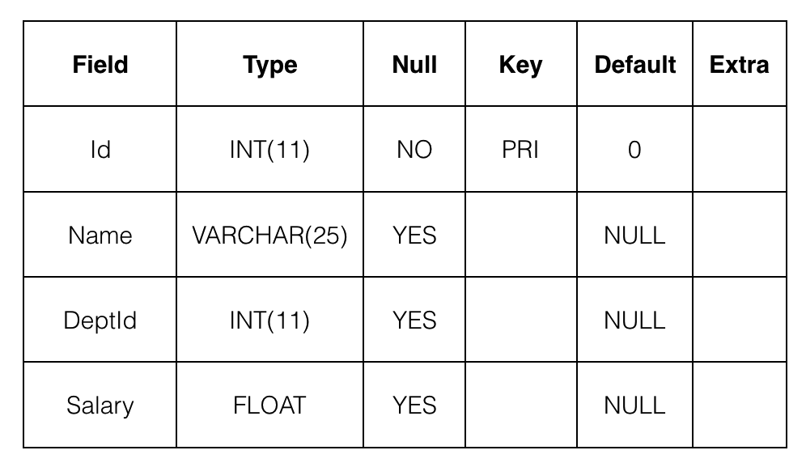

# 李泽聿的作业

## 数据库链接

```shell
mysql -uroot -p123123 -h127.0.0.1
```

## 1.初始MySql

[作业](./initial-mysql/script.sql)

## 2.单表查询

**第一关**


**第二关**


[作业](./single-table-query/script.sql)

## 3.库和表的基本操作



[作业](./basic-operations-for-libraries-and-tables/script.sql)

## 4.单表查询（二）

[作业](./single-form-inquiry-2/script.sql)

## 5.单表查询（三）

[作业](./single-form-inquiry-3/script.sql)

## 6.连接查询

[作业](./connect-query/script.sql)

## 7. 子查询

[作业](./subquery/script.sql)

## 8.复杂查询（一）

[作业](./complex-query-1/script.sql)

