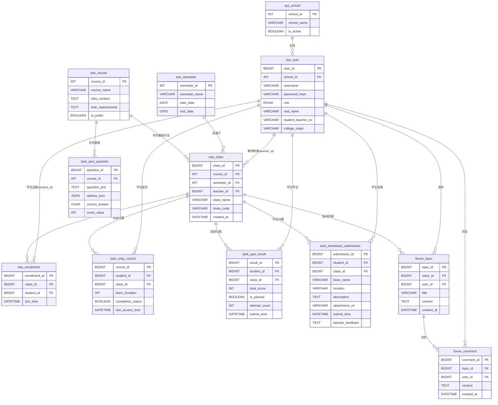

### 一、 核心实体与ER关系分析

**系统级实体**：学校（School）、学期（Semester）。
**用户级实体**：用户（User - 包含学生、教师、管理员）。
**教学实体**：课程模板（Course）、教学班级（Class - 课程+学期+教师的组合，这是数据隔离的核心）、选课记录（Enrollment）。
**业务实体**：
  * **任务一**：仿真实验记录（SimulationRecord）、测试题库（Question）、测试记录（ExamResult）。
  * **任务二**：爱国基地投稿（HometownSubmission）。
  * **讨论区**：帖子（Post）、评论（Comment）。
  
### E-R 表


### 1. 基础架构


**表名：`sys_school` (学校表)**

| 字段名 | 数据类型 | 属性/约束 | 说明 |
| :--- | :--- | :--- | :--- |
| `school_id` | INT | PK, Auto Inc | 学校ID |
| `school_name` | VARCHAR | | 学校名称 |
| `is_active` | BOOLEAN | | 是否启用 |

**表名：`sys_user` (用户表)**

| 字段名 | 数据类型 | 属性/约束 | 说明 |
| :--- | :--- | :--- | :--- |
| `user_id` | BIGINT | PK, Auto Inc | 用户ID |
| `username` | VARCHAR | **Unique** | 登录账号 |
| `password_hash` | VARCHAR | | 加密密码 |
| `role` | ENUM | 'student', 'teacher', 'admin' | 用户角色 |
| `school_id` | INT | FK | 所属学校ID |
| `real_name` | VARCHAR | | 真实姓名 |
| `student_teacher_no` | VARCHAR | | 学号/工号 |
| `college_major` | VARCHAR | | 学院/专业（注册时必填） |
| `phone` | VARCHAR | | 联系电话 |
| `created_at` | DATETIME | | 注册时间 |
| `status` | TINYINT | Default 1 | 1-正常, 0-禁用 |

---

### 2. 课程与教学教务模块

**表名：`edu_semester` (学期表)**

| 字段名 | 数据类型 | 属性/约束 | 说明 |
| :--- | :--- | :--- | :--- |
| `semester_id` | INT | PK | 学期ID |
| `semester_name` | VARCHAR | | 学期名称 (如 "2024-2025第一学期") |
| `start_date` | DATE | | 开始日期 |
| `end_date` | DATE | | 结束日期 |

**表名：`edu_course` (课程模板表)**

| 字段名 | 数据类型 | 属性/约束 | 说明 |
| :--- | :--- | :--- | :--- |
| `course_id` | INT | PK | 课程ID |
| `course_name` | VARCHAR | | 课程名称 |
| `intro_content` | TEXT | | 课程介绍（需求1） |
| `task_requirements` | TEXT | | 实践任务总体要求（需求1） |
| `is_public` | BOOLEAN | | 是否允许外校使用 |

**表名：`edu_class` (教学班级表 - 核心隔离表)**

| 字段名 | 数据类型 | 属性/约束 | 说明 |
| :--- | :--- | :--- | :--- |
| `class_id` | BIGINT | PK, Auto Inc | 班级ID |
| `course_id` | INT | FK | 关联课程ID |
| `semester_id` | INT | FK | 关联学期ID |
| `teacher_id` | BIGINT | FK | 任课教师ID |
| `class_name` | VARCHAR | | 班级名称 (便于教师辨识) |
| `invite_code` | VARCHAR | | 选课邀请码 (学生注册/选课时使用) |
| `created_at` | DATETIME | | 开课时间 |

**表名：`edu_enrollment` (选课关联表)**

| 字段名 | 数据类型 | 属性/约束 | 说明 |
| :--- | :--- | :--- | :--- |
| `enrollment_id` | BIGINT | PK | 记录ID |
| `class_id` | BIGINT | FK | 班级ID |
| `student_id` | BIGINT | FK | 学生ID |
| `join_time` | DATETIME | | 加入时间 |

---

### 3. 任务一：Unity仿真与测试模块

**表名：`task_unity_record` (仿真学习记录)**

| 字段名 | 数据类型 | 属性/约束 | 说明 |
| :--- | :--- | :--- | :--- |
| `record_id` | BIGINT | PK | 记录ID |
| `student_id` | BIGINT | FK | 学生ID |
| `class_id` | BIGINT | FK | 班级ID |
| `learn_duration` | INT | | 学习时长（秒）（需求6） |
| `completion_status` | BOOLEAN | | 是否完成仿真学习 |
| `last_access_time` | DATETIME | | 最后访问时间 |

**表名：`task_quiz_question` (题库表)**

| 字段名 | 数据类型 | 属性/约束 | 说明 |
| :--- | :--- | :--- | :--- |
| `question_id` | BIGINT | PK | 题目ID |
| `course_id` | INT | FK | 归属课程ID |
| `question_text` | TEXT | | 题目内容 |
| `options_json` | JSON | | 选项内容 (如 `{"A":"...", "B":"..."}`) |
| `correct_answer` | CHAR | | 正确选项 (A/B/C/D) |
| `score_value` | INT | Default 5 | 分值 (默认5分) |

**表名：`task_quiz_result` (测试成绩表)**

| 字段名 | 数据类型 | 属性/约束 | 说明 |
| :--- | :--- | :--- | :--- |
| `result_id` | BIGINT | PK | 成绩ID |
| `student_id` | BIGINT | FK | 学生ID |
| `class_id` | BIGINT | FK | 班级ID |
| `total_score` | INT | | 总分（满分100） |
| `is_passed` | BOOLEAN | | 是否及格 (>=70分) |
| `attempt_count` | INT | | 尝试次数 |
| `submit_time` | DATETIME | | 提交时间 |

---

### 4. 任务二：家乡爱国主义基地模块

**表名：`task_hometown_submission` (基地介绍提交表)**

| 字段名 | 数据类型 | 属性/约束 | 说明 |
| :--- | :--- | :--- | :--- |
| `submission_id` | BIGINT | PK | 提交ID |
| `student_id` | BIGINT | FK | 学生ID |
| `class_id` | BIGINT | FK | 班级ID |
| `base_name` | VARCHAR | | 基地名称 |
| `location` | VARCHAR | | 地理位置/家乡 |
| `description` | TEXT | | 介绍资料文本 |
| `attachment_url` | VARCHAR | | 图片或视频附件地址 |
| `submit_time` | DATETIME | | 提交时间 |
| `teacher_feedback` | TEXT | | 教师评语 (可选) |

---

### 5. 讨论区模块

**表名：`forum_topic` (讨论主题/帖子)**

| 字段名 | 数据类型 | 属性/约束 | 说明 |
| :--- | :--- | :--- | :--- |
| `topic_id` | BIGINT | PK | 帖子ID |
| `class_id` | BIGINT | FK | 归属班级ID (课程间不干扰) |
| `user_id` | BIGINT | FK | 发帖人ID |
| `title` | VARCHAR | | 标题 |
| `content` | TEXT | | 学习体会内容 |
| `created_at` | DATETIME | | 发布时间 |

**表名：`forum_comment` (评论)**

| 字段名 | 数据类型 | 属性/约束 | 说明 |
| :--- | :--- | :--- | :--- |
| `comment_id` | BIGINT | PK | 评论ID |
| `topic_id` | BIGINT | FK | 关联帖子ID |
| `user_id` | BIGINT | FK | 评论人ID |
| `content` | TEXT | | 评论内容 |
| `created_at` | DATETIME | | 评论时间 |
-----

### 三、 关键逻辑实现（存储过程与触发器）

为了保证数据的一致性和简化后端代码，我们可以使用数据库层面的逻辑。

#### 1\. 触发器 ：自动判断任务一是否及格

当学生提交测试成绩时，自动计算是否通过（\>=70分）。

```sql
DELIMITER //
CREATE TRIGGER trg_check_quiz_pass
BEFORE INSERT ON task_quiz_result
FOR EACH ROW
BEGIN
    IF NEW.total_score >= 70 THEN
        SET NEW.is_passed = 1;
    ELSE
        SET NEW.is_passed = 0;
    END IF;
END;
//
DELIMITER ;
```

#### 2\. 存储过程：教师开设新班级

需求6提到教师学期初设置开课信息。这是一个复杂的事务操作。

```sql
DELIMITER //

CREATE PROCEDURE sp_create_class_instance(
    IN p_teacher_id BIGINT,
    IN p_course_id INT,
    IN p_semester_id INT,
    IN p_class_name VARCHAR(100),
    OUT p_invite_code VARCHAR(20)
)
BEGIN
    -- 1. 生成邀请码
    -- 逻辑：MD5(教师ID + 课程ID + 学期ID + 当前毫秒级时间 + 班级名)
    -- 这样即便同一老师同一秒创建两个班，只要班名不同，码也不同
    SET p_invite_code = UPPER(SUBSTRING(MD5(CONCAT(p_teacher_id, p_course_id, p_semester_id, NOW(), p_class_name)), 1, 8));
    -- 2. 插入数据
    -- 注意：如果在 edu_class 表中 invite_code 设置了 UNIQUE 索引，
    -- 这里建议加一个简单的错误处理，或者在应用层处理重试，但在业务量不大时，碰撞概率极低。
    INSERT INTO edu_class (
        course_id, 
        semester_id, 
        teacher_id, 
        class_name, 
        invite_code, 
        created_at
    )
    VALUES (
        p_course_id, 
        p_semester_id, 
        p_teacher_id, 
        p_class_name, 
        p_invite_code, 
        NOW()
    );
END;
//
DELIMITER ;
```

#### 3\. 视图 (View)：教师端——任务一完成情况概览

需求6要求教师看到分数的时长。通过视图聚合两个表的数据，方便后端直接查询。

```sql
CREATE VIEW view_teacher_task1_summary AS
SELECT 
    e.class_id,
    u.student_teacher_no,
    u.real_name,
    tqr.total_score,
    tqr.is_passed,
    tur.learn_duration, -- 学习时长
    tur.completion_status AS sim_completed
FROM 
    edu_enrollment e
JOIN 
    sys_user u ON e.student_id = u.user_id
LEFT JOIN 
    task_quiz_result tqr ON e.student_id = tqr.student_id AND e.class_id = tqr.class_id
LEFT JOIN 
    task_unity_record tur ON e.student_id = tur.student_id AND e.class_id = tur.class_id;
```

*查询时只需：`SELECT * FROM view_teacher_task1_summary WHERE class_id = ?`*

#### 4\. 存储过程：管理员重置密码

需求7要求管理员可重置密码。

```sql
DELIMITER //
CREATE PROCEDURE sp_admin_reset_password(
    IN p_admin_id BIGINT,
    IN p_target_user_id BIGINT,
    IN p_new_password_hash VARCHAR(255)
)
BEGIN
    DECLARE v_role VARCHAR(20);
    
    -- 检查执行者是否为管理员
    SELECT role INTO v_role FROM sys_user WHERE user_id = p_admin_id;
    
    IF v_role = 'admin' THEN
        UPDATE sys_user 
        SET password_hash = p_new_password_hash 
        WHERE user_id = p_target_user_id;
    ELSE
        SIGNAL SQLSTATE '45000' SET MESSAGE_TEXT = 'Permission Denied';
    END IF;
END;
//
DELIMITER ;
```

-----

### 四、 针对特定需求的设计思考 (QA)

1.  **如何满足需求5（外校使用，互不干扰）？**

      * 通过 `sys_school` 表区分用户来源。
      * 通过 `edu_class` 表中的 `class_id` 作为所有业务数据（成绩、发帖、作业）的外键。哪怕不同学校的老师教同一门课，他们的 `class_id` 也是不同的，因此数据天然隔离。

2.  **如何满足需求3（Unity环境集成）？**

      * 数据库不直接存储Unity场景。Unity客户端通过API与后端交互。
      * 当学生进入Unity，前端调用API记录开始时间；退出时调用API更新 `task_unity_record` 中的 `learn_duration`。
      * 20道单选题建议由后端通过 `task_quiz_question` 随机抽取题目发送给前端（Unity或Web页面），学生提交答案后，后端计算分数并存入 `task_quiz_result`。

3.  **安全性与扩展性？**

      * 密码必须Hash存储（如Bcrypt）。
      * 所有的查询必须带上 `class_id` 和 `school_id` 过滤，防止越权查看数据。
      * 表结构中预留了 `attachment_url`，实际文件（图片/Unity包）应存储在对象存储（OSS/S3）中，数据库只存链接。
